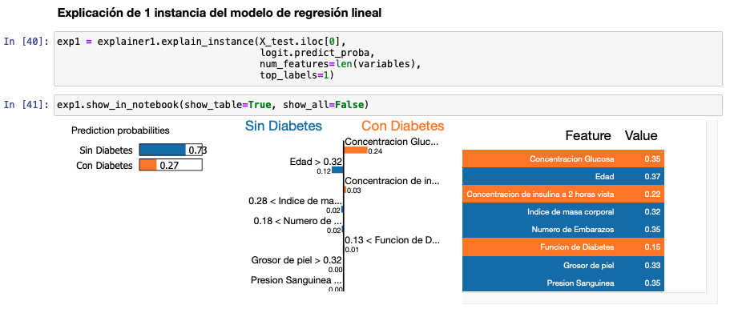
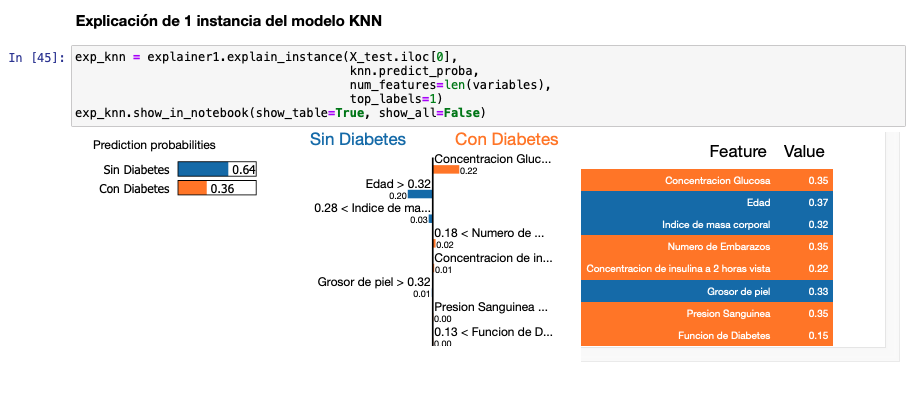
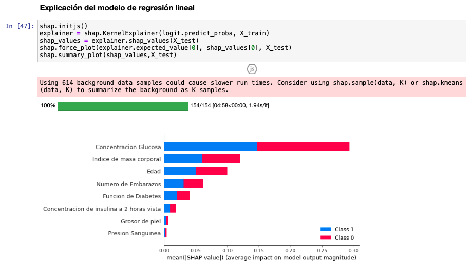
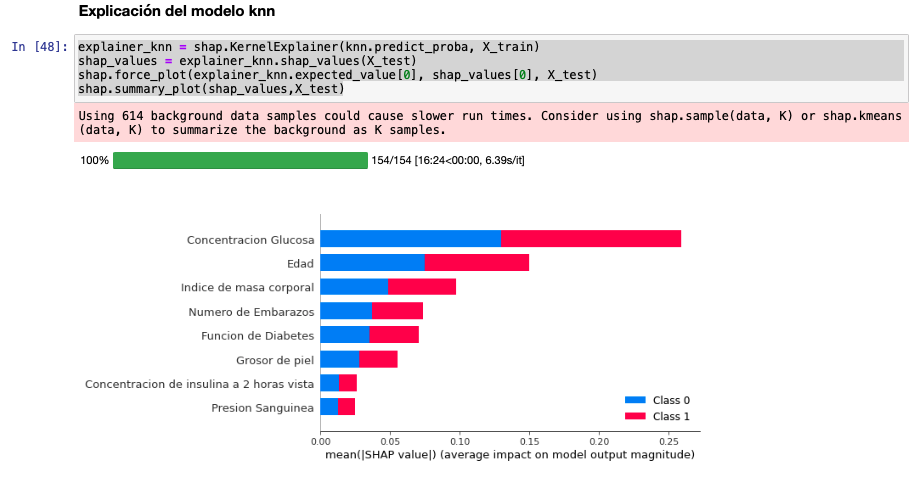
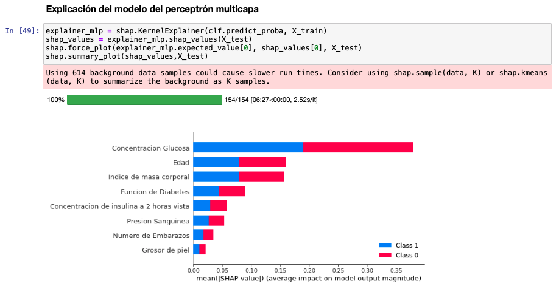
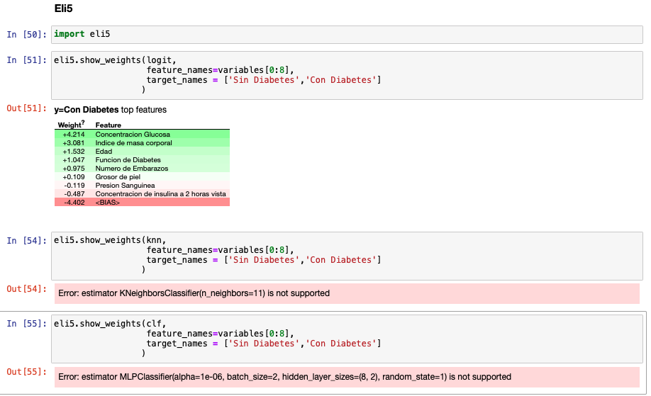

# Explainable aritificial intelligence (XAI)

Case study on the dataset [pima-indians-diabetes](https://www.kaggle.com/uciml/pima-indians-diabetes-database) on which three machine learning models are performed and explanations are made at the local level (i.e. for a specific prediction of its reasons) with LIME, and another at the global level with SHAP.

### LIME

### SHAP

### Eli5

